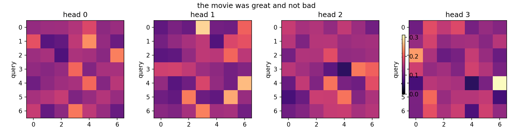
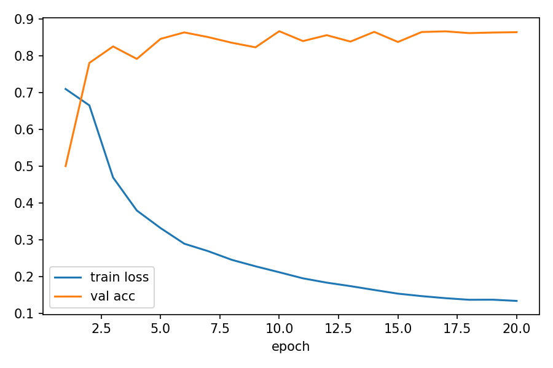
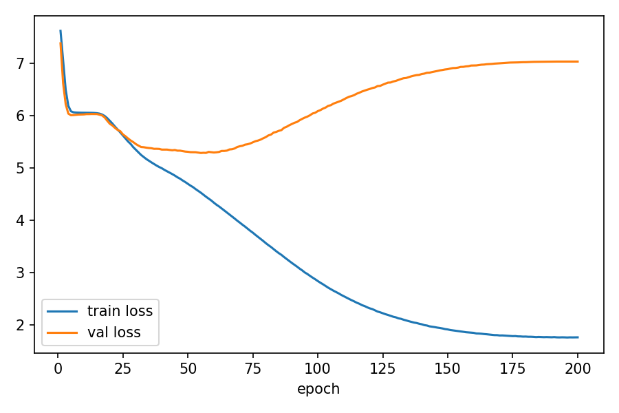
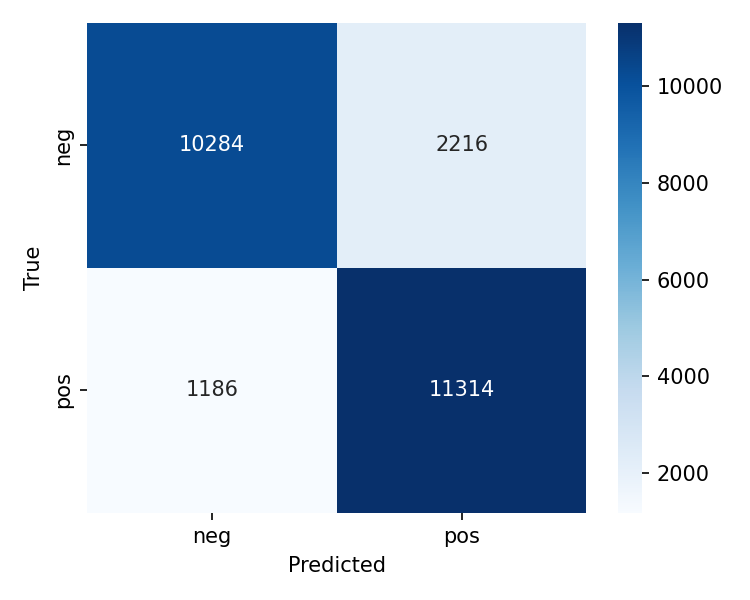
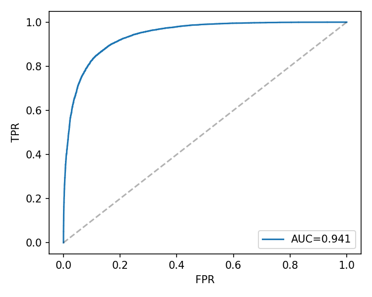
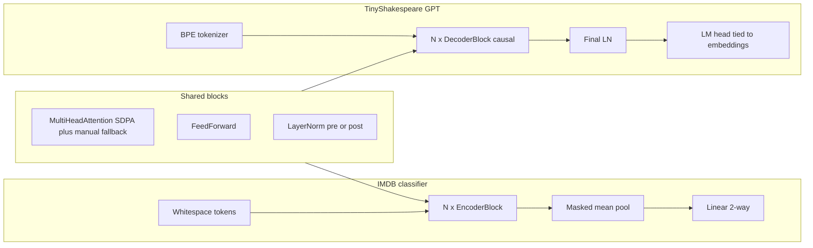

# Transformer from scratch (PyTorch)

Encoder-only **IMDB sentiment** classifier and **decoder-only GPT** on TinyShakespeare, built without Hugging Face `transformers` — multi-head attention, masks, training loop, Hydra configs, tests, ONNX export, profiling scripts, and a small synthetic trajectory sequence-modeling extension.

## Results

Numbers below are from **local GTX 1060** runs (`outputs/portfolio/clf` and `outputs/portfolio/gpt`). GPT metrics are **best validation** (epoch 55); classifier is **best val accuracy** (epoch 10). LM loss/PPL are **per byte-level BPE token** (vocab 2048).

| Model | Primary metric | Params | Tokens/sec (attn bench) | Peak VRAM (train-step bench) |
|------|----------------|--------|-------------------------|------------------------------|
| IMDB classifier | val acc **0.867** | **3.35M** | **~1.9M** | — |
| TinyShakespeare GPT | val loss **5.29** / PPL **198** | **11.5M** | **~1.9M** | **~80 MB** (fp16, 2-layer micro-GPT in `benchmark.py --train-step`) |

Regenerate the attention table with `python scripts/benchmark.py`. Training metrics: `outputs/portfolio/*/metrics.csv` or any Hydra `outputs/…/metrics.csv`. Train-step VRAM column comes from `docs/BENCHMARKS_TRAIN_STEP.md` (same GPU; not full `gpt_small` training peak).

The GPT run is included primarily to demonstrate decoder architecture, training infrastructure, export, profiling, and generation plumbing. Its current TinyShakespeare quality is limited: best validation loss is above the target range in `docs/MODEL_CARD_GPT.md`, and later epochs overfit.

### Ablation sanity checks

These are tiny fixed synthetic binary-classification runs on CPU, intended to check architecture switches rather than claim downstream benchmark gains. Full notes and regeneration command: [docs/ABLATIONS.md](docs/ABLATIONS.md), `python scripts/ablate.py`.

| Setting | Val accuracy |
|---------|-------------:|
| post-LN + sinusoidal positions | 0.625 |
| pre-LN + sinusoidal positions | 0.375 |
| pre-LN + learned positions | 0.625 |
| pre-LN + RoPE | 1.000 |
| pre-LN + RMSNorm | 0.375 |
| pre-LN + SwiGLU | 0.625 |
| GQA, 2 KV heads | 0.875 |

## Visualizations

**Encoder attention (synthetic demo)** — first-layer head grid from `scripts/viz_attention.py` (not a trained IMDB checkpoint):



**Training curves** — same portfolio GTX 1060 runs as the table above (`outputs/portfolio/…`; copies live under `docs/assets/portfolio/` for rendering here):





**Classifier evaluation** — confusion matrix and ROC on the held-out split at the end of training:





## Architecture



## Quickstart

Requires **Python 3.10+** (3.10 is fully supported; CI uses 3.10).

### CUDA: `no kernel image for execution on device`

That error means the **installed PyTorch binary does not include GPU kernels for your GPU’s compute capability** (or you have a CPU-only build). It is not a bug in this repo’s Python code.

1. Run `nvidia-smi` and note the **CUDA version** the driver supports (top right).
2. Reinstall PyTorch from [pytorch.org](https://pytorch.org/get-started/locally/) choosing a **wheel CUDA ≤ that driver CUDA** (e.g. cu121, cu124). Example for CUDA 12.x driver:

   `pip install --force-reinstall torch --index-url https://download.pytorch.org/whl/cu121`

3. Smoke-test: `python scripts/cuda_smoke.py`
4. If it still fails on a **brand-new GPU**, upgrade PyTorch to the **latest** stable release (wheels add new `sm_*` targets over time).
5. Workaround: train on CPU with `train.device=cpu` (Hydra override).

If you use `torch.compile`, try `train.compile=false` on older or quirky setups.

### Training looks like “hundreds of threads” or tqdm glitches

Hydra or narrow terminals can make **tqdm** redraw badly (many `epoch N` fragments on one line). The trainer now refreshes more slowly, uses a fixed bar width, and **disables tqdm when stderr is not a TTY**. It also sets `TOKENIZERS_PARALLELISM=false` and caps BLAS/OpenMP threads by default so tokenizers + NumPy do not spawn large thread pools. To use all CPU cores for something else, export `OMP_NUM_THREADS` / `MKL_NUM_THREADS` before launching.

```bash
python -m pip install -U pip
pip install -e ".[dev]"
# optional UI
pip install -e ".[app]"
```

**Train classifier (Hydra):**

```bash
python scripts/train_classifier.py
```

**Train GPT:**

```bash
python scripts/train_gpt.py
```

**Generate text** (expects `best_model.pt` and `data/tinyshakespeare/tokenizer.json`):

```bash
python scripts/generate.py --prompt "ROMEO:" --checkpoint best_model.pt
```

**Gradio demo** (two tabs: sentiment + GPT):

```bash
python app/gradio_app.py
```

**Docker** (CUDA base image; default command runs CPU-safe tests):

```bash
docker build -t transformer-fs .
docker run --rm transformer-fs
# With GPU for training inside the container:
# docker run --gpus all -v "$PWD/outputs:/app/outputs" -it transformer-fs bash
```

## Project layout

| Path | Role |
|------|------|
| [src/transformer/models/](src/transformer/models/) | Attention, blocks, classifier, GPT |
| [src/transformer/data/](src/transformer/data/) | IMDB loaders, TinyShakespeare + BPE |
| [src/transformer/training/](src/transformer/training/) | Trainer (AMP, compile, CSV, W&B, checkpoints) |
| [configs/](configs/) | Hydra defaults for both tasks |
| [scripts/](scripts/) | train, generate, benchmark, profiler, ONNX, viz, ablations |
| [tests/](tests/) | Masking, PE math, MHA vs `torch.nn`, overfit smoke, ONNX |
| [docs/](docs/) | Model cards, benchmark / ablation templates |

## Tooling

- **Ruff** lint + format, **mypy** strict on `src/transformer`, **pytest** in CI (`.github/workflows/ci.yml`).
- **Hydra** run dirs under `outputs/` (gitignored).
- **Weights & Biases**: set `train.wandb=true` in a Hydra override or compose config; offline: `WANDB_MODE=offline`.

## Scripts

| Script | Purpose |
|--------|---------|
| `scripts/train_classifier.py` | Hydra IMDB training |
| `scripts/train_gpt.py` | Hydra LM training |
| `scripts/evaluate.py` | Evaluate classifier/GPT checkpoints from `run_metadata.json` or config |
| `scripts/train_robotics_sequence.py` | Synthetic 2D trajectory next-token task |
| `scripts/generate.py` | Sample from GPT checkpoint |
| `scripts/benchmark.py` | Attention forward timing → `docs/BENCHMARKS.md` |
| `scripts/torch_profiler.py` | Chrome trace export (renamed to avoid stdlib `profile` shadowing) |
| `scripts/export_onnx.py` | ONNX + ORT numeric check |
| `scripts/viz_attention.py` | Attention heatmaps → `docs/assets/attention/` |
| `scripts/ablate.py` | Quick synthetic ablations → `docs/ABLATIONS.md` |
| `scripts/portfolio_pipeline.sh` | Ordered train + benchmarks + ONNX + docs assets; `make portfolio-pipeline` |

## Design choices

- **SDPA first**, manual attention when `return_attn_weights=True` (visualization) or if SDPA raises.
- **Pre-LN vs post-LN** exposed on blocks for ablations; GPT defaults to pre-LN.
- **Padding + causal masks** unified in `MultiHeadAttention`.
- **GPT weight tying** between token embedding and LM head.
- **AMP**: bf16 on CUDA when enabled; fp16 uses `GradScaler`.

## ONNX and TensorRT

`python scripts/export_onnx.py` writes `docs/assets/onnx/` and checks ORT vs PyTorch logits (`atol=1e-4`). For NVIDIA deployment, compile the exported ONNX with [TensorRT](https://developer.nvidia.com/tensorrt) using the versioned CLI or `trtexec` from your TensorRT install.

## Robotics sequence extension

`python scripts/train_robotics_sequence.py --dry-run` trains a tiny decoder on synthetic discretized 2D trajectories. This is not a robotics benchmark; it is a CPU-friendly extension that exercises trajectory tokenization, autoregressive sequence modeling, and honest limitations. See [docs/ROBOTICS_SEQUENCE.md](docs/ROBOTICS_SEQUENCE.md).

## References

- Vaswani et al., [*Attention Is All You Need*](https://arxiv.org/abs/1706.03762)
- IMDB: Maas et al., [*Learning Word Vectors for Sentiment Analysis*](https://aclanthology.org/P11-1015/)
- TinyShakespeare corpus (Karpathy char-rnn mirror) for LM demos
