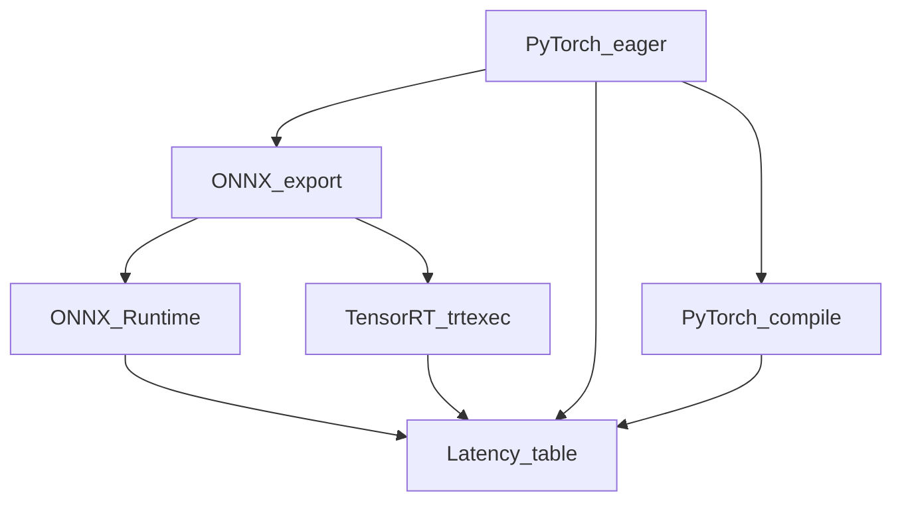

# Systems view (inference and training)

## Deployment / inference stack

- **PyTorch (eager / `torch.compile`)**: `scripts/bench_inference.py` — see [INFERENCE_BENCHMARKS.md](INFERENCE_BENCHMARKS.md).
- **ONNX + ORT**: `python scripts/export_onnx.py` then ORT CPU or CUDA execution provider in the same script.
- **TensorRT**: `python scripts/build_trt_engine.py` generates a `.plan` from ONNX; use `trtexec` and your target GPU.
- **KV cache**: `GPTModel.generate` uses per-layer key/value pasts; see [INFERENCE_BENCHMARKS.md](INFERENCE_BENCHMARKS.md) and the `generate` path in [../src/transformer/models/gpt.py](../src/transformer/models/gpt.py).
- **Kernels**: [KERNELS.md](KERNELS.md) (RMSNorm micro-bench) and [../src/transformer/kernels/rmsnorm_triton.py](../src/transformer/kernels/rmsnorm_triton.py) (eager baseline; hook for fused Triton).

## Multi-GPU training

- `torchrun --nproc_per_node=2 scripts/train_gpt.py train=ddp_lm` (see [../configs/train/ddp_lm.yaml](../configs/train/ddp_lm.yaml)).
- [../src/transformer/training/trainer.py](../src/transformer/training/trainer.py) enables DDP when `WORLD_SIZE>1` and `Local` process group is initialized by `torchrun`.

## What to do next (out of this repo’s scope, but on the short list)

- **FSDP** for very large decoders, **FP8** on H100, **Triton Inference Server** for a model repository, and **CUDA Graphs** for fixed-shape low-latency serving.
- **ORT static INT8** for the classifier: use `onnxruntime.quantization` with a real calibration dataloader (IMDB) and compare p50/p95 in `bench_inference.py`.
